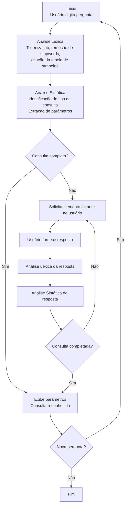

# Analisador Léxico e Sintático para Consultas em Linguagem Natural

Este projeto implementa um analisador léxico e sintático para processar consultas em linguagem natural sobre documentos eletrônicos. Ele identifica tokens, filtra stopwords, sugere correção de palavras e interpreta perguntas e respostas conforme uma gramática BNF.

---

## **Sumário**

- [Visão Geral](#visão-geral)
- [Funcionalidades Principais](#funcionalidades-principais)
- [Estrutura do Projeto](#estrutura-do-projeto)
- [Como Usar](#como-usar)
- [Fluxo de Execução](#fluxo-de-execução)
- [Gramática Suportada (BNF)](#gramática-suportada-bnf)
- [Exemplos de Uso](#exemplos-de-uso)
- [Detalhes de Implementação](#detalhes-de-implementação)
- [Personalização](#personalização)

---

## Visão Geral

O projeto é composto por dois módulos principais:

- **Analisador Léxico (`LexicalAnalyzer`)**: Segmenta a entrada em tokens, ignora stopwords, constrói uma tabela de símbolos, sugere correções de palavras e classifica tokens.
- **Analisador Sintático (`SyntaxAnalyzer`)**: Interpreta a sequência de tokens, identifica o tipo de consulta, verifica a completude e solicita informações adicionais se necessário.

O sistema é interativo: o usuário digita perguntas, recebe feedback e pode complementar informações faltantes.

---

## Funcionalidades Principais

- **Tokenização**: Divide o texto em palavras, pontuações e delimitadores.
- **Remoção de Stopwords**: Ignora palavras irrelevantes para a análise semântica.
- **Tabela de Símbolos**: Mantém as palavras relevantes encontradas.
- **Correção de Palavras**: Sugere palavras semelhantes já conhecidas, usando distância de Levenshtein.
- **Classificação de Tokens**: Identifica tipos como `WORD`, `PUNCTUATION`, `DELIMITER`.
- **Reconhecimento de Consultas**: Suporta perguntas e respostas seguindo uma gramática BNF específica.
- **Interação Dinâmica**: Solicita ao usuário informações faltantes para completar a consulta.

---

## Estrutura do Projeto

```
/LexicalAnalyzer/
    LexicalAnalyzer.h
    LexicalAnalyzer.cpp
/SyntaxAnalyzer/
    SyntaxAnalyzer.h
    SyntaxAnalyzer.cpp
Token.h
main.cpp
```


---

## Como Usar

1. **Compilação**
   Compile todos os arquivos fonte do projeto em C++ (requer suporte a C++11 ou superior).

2. **Execução**
   Execute o binário gerado. O programa abrirá um prompt interativo.

3. **Interação**
    - Digite perguntas em linguagem natural, como “Qual documento está no PDF?”.
    - O sistema processa a consulta, identifica informações faltantes e solicita complementos.
    - Digite “sair” para encerrar.

---

## Fluxo de Execução

1. **Entrada do Usuário**
    - O usuário digita uma pergunta.
2. **Análise Léxica**
    - O texto é segmentado em tokens.
    - Stopwords são removidas.
    - Palavras relevantes são adicionadas à tabela de símbolos.
    - Correções são sugeridas para palavras desconhecidas.
3. **Análise Sintática**
    - Os tokens são analisados conforme a gramática BNF.
    - O tipo de consulta é identificado (formato, tamanho, título, data, palavra-chave).
    - Se faltar algum elemento (ex: formato, título), o sistema solicita ao usuário.
4. **Resposta**
    - Quando a consulta está completa, os parâmetros extraídos são exibidos.

---

## Gramática Suportada (BNF)

O sistema reconhece perguntas e respostas conforme a seguinte gramática simplificada[2]:

### **Perguntas**

| Forma Natural                                 | Estrutura BNF                                      |
|------------------------------------------------|----------------------------------------------------|
| Qual documento está no ``?            | ` ::= Qual documento está no  ?` |
| Qual tamanho tem o documento ``?       | ` ::= Qual tamanho tem o documento  ?` |
| Qual documento tem o título ``?        | ` ::= Qual documento tem o título  ?` |
| Quais documentos foram criados em ``?    | ` ::= Quais documentos foram criados em  ?` |
| Mostre documentos sobre ``      | ` ::= Mostre documentos sobre ` |

### **Respostas**

| Forma Natural                                 | Estrutura BNF                                      |
|------------------------------------------------|----------------------------------------------------|
| O formato é ``                        | ` ::= O formato é `             |
| Quero tamanho maior que ``             | ` ::= Quero tamanho maior que `  |
| O título correto é ``                  | ` ::= O título correto é `       |
| Só documentos após ``                    | ` ::= Só documentos após `         |
| Eu quis dizer ``                | ` ::= Eu quis dizer `     |

---

## Exemplos de Uso

### **Perguntas**

- `Qual documento está no PDF?`
- `Qual tamanho tem o documento relatório_final?`
- `Mostre documentos sobre compiladores BNF`

### **Respostas**

- `O formato é DOCX`
- `Quero tamanho maior que 1024`
- `Só documentos após 01/01/2023`

---

## Detalhes de Implementação

### **Analisador Léxico**

- **Stopwords**: Carrega uma lista padrão de palavras irrelevantes para consulta.
- **Validação de Caracteres**: Apenas caracteres definidos em `validChars` são aceitos.
- **Sugestão de Correção**: Se a palavra não estiver na tabela de símbolos, sugere a mais próxima (distância de Levenshtein ≤ 2).
- **Tokens**: Cada token contém lexema, tipo, linha e coluna.
- **Tabela de Símbolos**: Palavras relevantes são registradas para referência e sugestões futuras.

### **Analisador Sintático**

- **Identificação do Tipo de Consulta**: Usa as primeiras palavras do token stream para determinar o tipo (formato, tamanho, etc.)[1].
- **Parâmetros**: Extrai parâmetros relevantes (formato, título, data, palavra-chave, número).
- **Verificação de Completude**: Se faltar algum elemento, armazena o que está faltando e solicita ao usuário.
- **Respostas**: Processa respostas do usuário para completar consultas pendentes.

---

## Personalização

- **Stopwords**: Edite a lista em `LexicalAnalyzer::loadStopwords()` para adaptar ao seu domínio.
- **Gramática**: Amplie as funções de análise sintática para suportar novas estruturas de perguntas e respostas.
- **Validação**: Adapte o método `isValidChar` para aceitar outros caracteres conforme necessário.

---

## Observações Finais

- O sistema é modular e pode ser integrado a engines de busca, chatbots ou assistentes virtuais.
- A gramática pode ser expandida para suportar mais tipos de consultas.
- O código é orientado a objetos, facilitando manutenção e extensão[3].

---